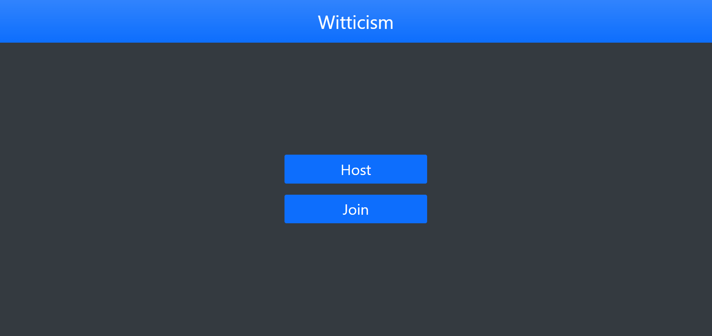

# Witticism Front-End

This is the front-end for a game that's inspired by party games like Quiplash and Cards Against Humanity. Inspired by my real-life suffering due to covid and friends that moved away after college! Jokes aside, the finished product would be able to be played remotely over your preferred video conferencing software. Also, believe it or not, Witticism *is* a real word.. I am not actually that clever.

[Back-End Repo](https://github.com/cosmicavocado/witticism-backend)

# Technologies

- Angular & Angular CLI
- BootStrap 5
- Java
- Spring Boot
- IntelliJ
- vsCode

# Planning

## Design

- [User Stories](planning/user-stories.md)
- [Wireframes](/planning/wireframe.md)
- [ERD](/planning/erd.png)

## Process

- Concept
- Design / Planning
    - Initial project description
    - User Stories
    - Wireframes
- Project Approval
- Implementation

# What Would I Do Differently

- Aimed to do a little too much given the amount of time I had
    - Had to trim a lot and refactor code to adjust for the smaller scale
- Thought front-end components would be hardest part for me so I made a bunch of them over the weekend (which were to match my original wireframes).
    - Many of the components were scrapped when I scaled back

# Challenges

- Learning to use jackson databind properly to read and write data
- Chaning multiple API calls — It takes some time for the data to be returned so you have to be mindful in your approach

# Wins

- I made a strong attempt at mimicking a game I've always loved
- Game is mostly in working order
- I got to learn a ton about angular
- I can build on this and improve

# What I Learned

- How to convert POJO to JSON and visa versa using a Maven Dependency called [jackson databind](https://mvnrepository.com/artifact/com.fasterxml.jackson.core/jackson-databind)
    - You can serialize an object as a string that can be stored in a database column
    - You can also deserialize it back into an object
    - This can be a useful technique for when you want to work with data without having a dedicated model
    - Drawbacks: not optimized for large scale (slower than a dedicated model)
    - Use this technique sparingly when you know it won't negatively affect the performance of your application
- Polling in Angular
    - A client can make a request to the server on a timer to check for changes and update itself accordingly
    - This method is useful for applications where a web socket might not be appropriate
    - It can take a toll on performance so that is a consideration to keep in mind
    - Here is a [simple example](https://medium.com/weekly-webtips/polling-in-angular-how-to-use-rxjs-in-angular-for-polling-14c519f4c218) for anyone who may be interested

# Acknowledgements

- Thanks to everyone on the instructional team for giving me a wonderful experience that I will keep with me for life. I can quite honestly say I've never had a learning experience as impactful or fulfilling as this one.
    - Special thanks to Usman for being an amazing team-lead and going above and beyond in his role.
- Thanks to Interapt for the opportunity to develop the career skills I've been seeking.